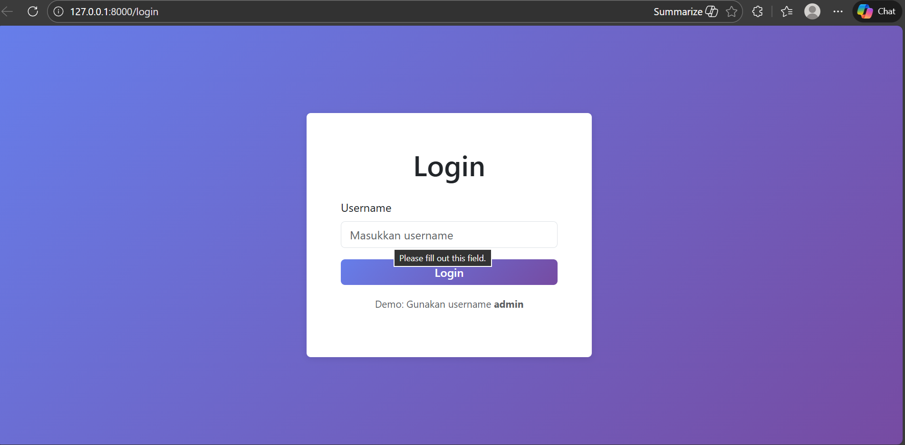
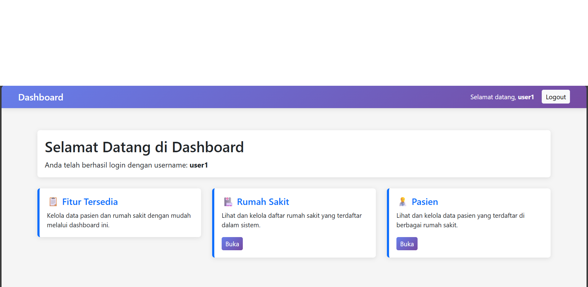
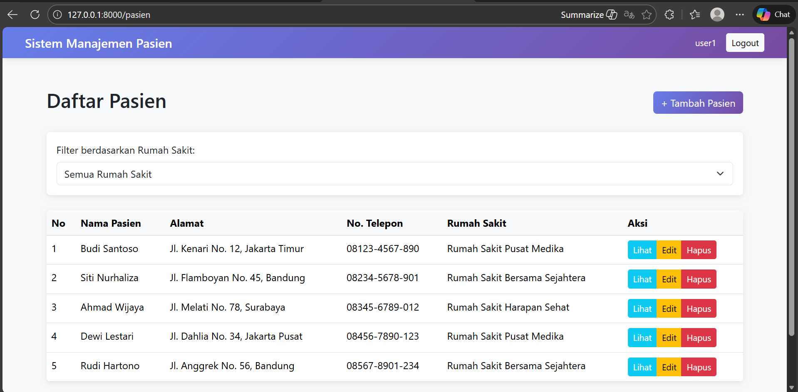
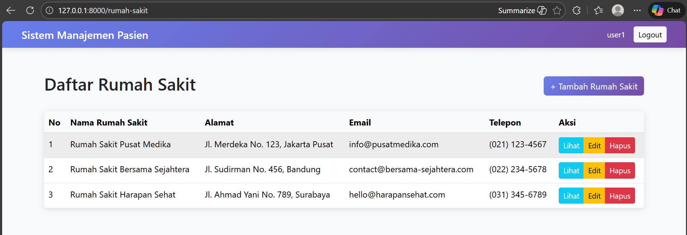

# Sistem Manajemen Pasien

Aplikasi web untuk mengelola data pasien dan rumah sakit. Dibangun dengan Laravel, Bootstrap 5, dan Vite.

## Fitur Utama

- **Autentikasi**: Login berbasis username dengan session management
- **CRUD Pasien**: Kelola data pasien lengkap dengan relasi rumah sakit
- **CRUD Rumah Sakit**: Kelola data rumah sakit
- **Filter Dinamis**: Filter pasien berdasarkan rumah sakit
- **Delete AJAX**: Hapus data tanpa reload halaman dengan konfirmasi
- **Bootstrap 5**: UI responsif dan modern
- **SQLite Database**: Database file-based untuk kemudahan deployment

## Screenshots

### Login Page
Login sederhana dengan username. Demo username: `admin`


### Dashboard
Selamat datang dashboard dengan akses cepat ke fitur utama


### Daftar Pasien
Halaman utama pasien dengan filter dropdown berdasarkan rumah sakit dan AJAX delete


### Daftar Rumah Sakit
Halaman manajemen rumah sakit dengan tabel responsif


## Tech Stack

- **Backend**: Laravel 11
- **Frontend**: Bootstrap 5.3.0
- **Build Tool**: Vite 7
- **Database**: SQLite
- **HTTP Client**: Axios
- **JavaScript**: Vanilla JS dengan Fetch API

## Instalasi

### Prerequisites
- PHP 8.2+
- Composer
- Node.js & npm

### Setup

1. Clone repository
```bash
git clone <repository-url>
cd Laravel_Alexander_Hansen
```

2. Install dependencies
```bash
composer install
npm install
```

3. Setup environment
```bash
cp .env.example .env
php artisan key:generate
```

4. Setup database
```bash
touch database/database.sqlite
php artisan migrate
php artisan db:seed
```

5. Build assets
```bash
npm run build
```

6. Start server
```bash
php artisan serve
```

Server akan berjalan di `http://127.0.0.1:8000`

## Demo Credentials

| Username | Password |
|----------|----------|
| admin    | -        |
| user1    | -        |
| user2    | -        |

*Login hanya memerlukan username, tidak ada password*

## Database Schema

### Users Table
- id
- username
- timestamps

### Rumah Sakit Table
- id
- namaRS
- alamat
- email
- tlp
- timestamps

### Pasien Table
- id
- namaPasien
- alamat
- noTlp
- RSID (foreign key)
- timestamps

## Fitur CRUD

### Pasien
- ✅ Create - Tambah pasien baru
- ✅ Read - Lihat daftar pasien dengan pagination
- ✅ Update - Edit data pasien
- ✅ Delete - Hapus pasien dengan AJAX

### Rumah Sakit
- ✅ Create - Tambah rumah sakit baru
- ✅ Read - Lihat daftar rumah sakit
- ✅ Update - Edit data rumah sakit
- ✅ Delete - Hapus rumah sakit dengan AJAX

## Fitur Filter

Pada halaman Daftar Pasien terdapat dropdown filter untuk menyaring pasien berdasarkan rumah sakit:
- Semua Rumah Sakit (default)
- Pilih rumah sakit spesifik
- Reset filter untuk kembali ke tampilan semua

Filter terintegrasi dengan pagination dan AJAX delete.

## Deployment Notes

- Database SQLite disimpan di `/database/database.sqlite`
- Assets dicompile ke `/public/build`
- Session berbasis file tersimpan di `/storage/framework/sessions`
- Logs tersimpan di `/storage/logs`

## License

This project is licensed under the MIT License.
